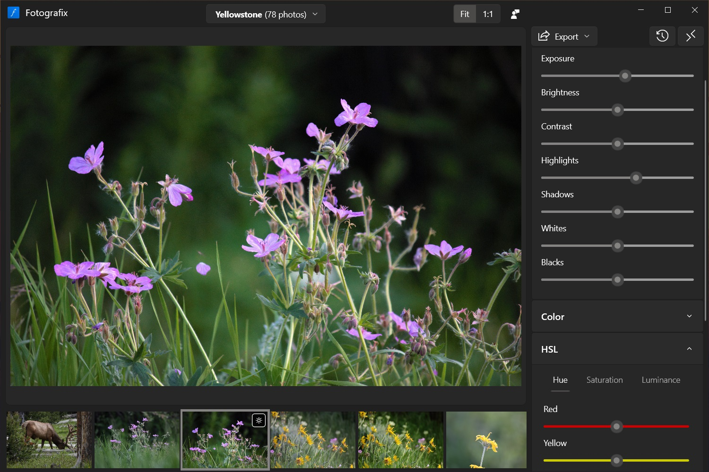

<h1>Fotografix</h1>
<h2 class="tagline">Modern photo editor for Windows</h2>

    <a href="https://www.microsoft.com/store/apps/9NBZQK3WVN38?cid=website" class="button">Get it from the Microsoft Store</a>
      
    

    <input type="radio" name="tabs" id="tab1" checked="checked" />
    <label for="tab1">Non-destructive editing</label>
    

        
Your original photos are never modified directly. Instead, Fotografix keeps track of your individual adjustments so you can come back at any time to tweak or revert your changes.

    

    <input type="radio" name="tabs" id="tab2" />
    <label for="tab2">Selective color adjustments</label>
    

        
HSL sliders allow you to make independent adjustments to different color ranges. You can enhance, mute or even completely change specific colors in your photo.

    

    <input type="radio" name="tabs" id="tab3" />
    <label for="tab3">Hardware accelerated rendering</label>
    

        
Fotografix makes full use of your computer's graphics hardware to display real-time previews. The rendering pipeline is optimized to perform well even on modest hardware.

    

<h2>Feature comparison</h2>
<table id="comparison">
    <tr>
        <th></th>
        <th width="20%"> Fotografix</th>
        <th width="20%"> Adobe Lightroom</th>
        <th width="20%"> Microsoft Photos</th>
    </tr>
    <tr>
        <td></td>
        <td>Free and open source</td>
        <td>Creative Cloud subscription</td>
        <td>Included with Windows</td>
    </tr>
    <tr>
        <td>Basic adjustments</td>
        <td></td>
        <td></td>
        <td></td>
    </tr>
    <tr>
        <td>Non-destructive editing</td>
        <td></td>
        <td></td>
        <td></td>
    </tr>
    <tr>
        <td>Batch export/resize</td>
        <td></td>
        <td></td>
        <td></td>
    </tr>
    <tr>
        <td>Selective color adjustments</td>
        <td></td>
        <td></td>
        <td></td>
    </tr>
    <tr>
        <td>Local adjustments</td>
        <td></td>
        <td></td>
        <td></td>
    </tr>
    <tr>
        <td>Photo organization</td>
        <td></td>
        <td></td>
        <td></td>
    </tr>
</table>

<h2>Frequently asked questions</h2>

    
What are the system requirements for Fotografix?

    
Fotografix requires a device running Windows 10 or 11. While Fotografix should run just fine on any modern hardware, a dedicated graphics card can help improve editing performance.

    
How can I report a problem or suggest a feature?

    
Issues are tracked on <a href="https://github.com/lmadhavan/fotografix/issues?q=is%3Aissue+is%3Aopen+sort%3Aupdated-desc">GitHub</a>. Please check to see if your problem or feature request already has an open issue before creating a new one.

    
Where can I find the old version of Fotografix?

    
Version 1.5 was the final release of the old Fotografix that offered general-purpose image editing features. If you are still interested in this version, it is available on the <a href="https://github.com/lmadhavan/fotografix/releases/tag/v1.5">GitHub releases page</a>.

